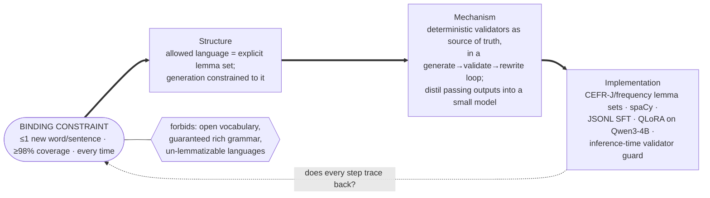

# Design under constraint

This applies the two methods from `docs/more_notes.txt` to the i+1 Story SLM and uses them to
audit what is already built:

- **Module 1 — Constraint-First Design:** name the binding constraint, then derive every decision.
- **Module 2 — Representation & the data/code seam:** choose what must be cheap, name what that
  makes expensive.

It is a design artifact for *this project*. The personal Part-B reflections, the peer response,
and the cohort submission are left to the owner (see the end).

---

## Part 1 — Constraint-first design

**System (one line):** a small, local model that writes comprehensible-input stories for a
language learner.

**1 · Binding constraint (one sentence).**
Every sentence may add at most one new word while the whole story stays ≥98% inside the
learner's known vocabulary — reliably, on every single output.

That is not the feature ("write learner stories"); it is the force that forbids the obvious
build. The naive build — prompt a capable model to "write a simple story" — fails this the moment
one sentence leaks a second unknown word or an off-list word, which prompting does often and
unpredictably (IFEval; SRS-Stories needed validators + rewriting even at 70B).

**2 · Shape: conjunction.**
This is not one good traded against another; it is several goods demanded *together*: coverage,
≤1-new-word pacing, inferability, recurrence, engagement — and reliability across all of them. So
the job is to hunt for the *unifying mechanism*, not to optimise a single trade.

The unifying idea: **make deterministic validators the single source of truth** — the same
checks that *manufacture* data (inside a generate→validate→rewrite loop), *grade* the eval, and
later *guard* inference. One mechanism delivers most of the goods. (Honest edge: two goods —
inferability and engagement — are not deterministically checkable, so they ride a separate, more
expensive LLM-judge path. The conjunction is ~80% unified, not 100%.)

**3 · Most restrictive model that still does the job.**
Not "open-ended generation we hope stays in level." The restrictive model is **generation
constrained to an explicit allowed lemma set, with a deterministic validator as ground truth**,
and the behavior *distilled into the weights* (SFT) rather than requested by prompt. It cannot
write freely — and that restriction is the point: it makes the one operation we need (produce
in-budget text) cheap and repeatable.

**4 · Derivation chain.**

Every step is a consequence of the one before it. The validator backbone, the JSONL schema, the
choice to distil rather than prompt at runtime — each traces to the constraint, not to
familiarity.

**5 · What the restriction forbids (the honest cost).**
Given up: open-ended vocabulary, idioms, guaranteed grammatical richness, and — for now —
languages without reliable lemmatization/segmentation (Chinese comes later). Bought: reliable
comprehensible input from a cheap model that runs on one consumer GPU, with a hard, measurable
pass/fail on every output.

---

## Part 2 — Representation & the data/code seam

**1 · Hot operations.**
The workload is dominated by one thing: **given a story and the sets K (known) and T (target),
map each token to a lemma and test set-membership**, counting new-words-per-sentence and target
recurrence. It runs on every candidate, on every rewrite pass (≤5), on every eval item, and at
inference time. If we named a structure before this workload, we'd start over — the hot path is
`token → lemma → membership`.

**2 · Representation + the whole ledger.**
K and T are **hash sets of lemmas**; a story is reduced to `(surface, lemma)` tokens.

- **Cheap:** membership, counting, first-occurrence tracking — all O(tokens), no model needed.
- **Expensive:** anything needing word order, syntax, morphology beyond the lemmatizer, or
  meaning — grammaticality, *true* inferability, semantic coherence. We made those expensive on
  purpose and pushed them to the LLM judge/cloze, which run rarely.

The bet: comprehensibility is overwhelmingly a *lexical-membership* question, so we optimise for
that and pay for meaning only where we must.

**3 · Precomputation + what it assumes is static.**

- Vocabulary lemma sets and frequency bands are loaded/precomputed once — assumes word lists are
  static (CEFR-J / New HSK change rarely: safe).
- The dataset is generated offline — assumes the Behavior Spec is static (if the spec changes,
  regenerate; the spec *is* the rubric).
- Deliberately **not** precomputed: the learner's known set is a **runtime input**, never baked
  into the weights — because a learner's vocabulary changes. Baking it in would be the
  precompute-over-changing-data trap; keeping K at inference is us refusing that trap.

**4 · The mechanism/content seam.**
The line is drawn where the rate of change changes: **engine** (`src/islm/`: validators, llm,
datagen, eval) vs **content** (`data/vocab/` word lists, `data/generated/` stories,
`evals/scenarios/`).

- **Permits:** swap word lists, teacher, or base model; publish the dataset to the HF Hub; point
  analytics straight at the raw JSONL; add a language — all without touching the engine.
- **Forbids:** nothing we currently need. The seam is already the committed `src/` vs `data/`
  split.

---

## Traps self-check (honest audit of the current build)

| Trap (from the gists) | Verdict here |
| --- | --- |
| Requirement dressed up as a constraint | Avoided — the constraint forbids a build (naive prompting), not just "must have stories". |
| Constraint that needs a paragraph | One sentence; bundled forces (inferability, engagement) are named separately as the judge path. |
| Decoration (a decision that doesn't trace back) | None found: validators, JSONL, distillation, runtime-K all trace to the constraint. |
| Naming the structure before the workload | Avoided — the hot op (lemma membership) drove the set representation. |
| Listing only the cheap column | Named the expensive column: syntax/meaning, delegated to the (rare) LLM judge. |
| Precomputing changing data | Avoided — learner K is a runtime input, not trained in; only static word lists/spec are precomputed. |
| No seam / seam in the wrong place | Clean engine/content seam = `src/` vs `data/`, drawn up front. |

---

## Left to the owner (not fabricated here)

Both take-homes include a **Part B — three personal reflections** ("a time you…") and an optional
**peer response**, plus **submission to the cohort channel**. Those are yours: they need your real
experience and your account. Happy to (a) compress each Part 1 / Part 2 above into a submittable
~350-word write-up, and (b) turn your rough notes on the Part-B prompts into tight paragraphs —
just share the experiences you want to use.
